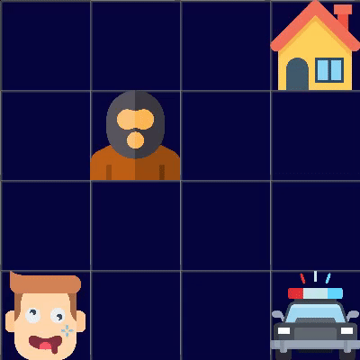

# Wasted Gridworld
Our totally wasted grid world agent calls us and asks if we can safely navigate him home. We use the WhatsApp location sharing feature to determine the agent location. Our goal is to message the agent a policy plan which he can use to find his way back home. Like every drunk guy, the agent does noisy movements: he follows our instructions only in 80% of the time. In 10% of the time, he stumbles WEST instead of NORTH and in the other 10%, he stumbles EAST instead of NORTH. Similar behavior occurs for the other instructions. If he stumbles against a wall, he enters the current grid cell again. He gets more tired of every further step he takes. If the police catch him, he has to pay a fee and is afterward much more tired. On the way back home it could happen, that he gets some troubles with the wrong guys, and in his condition, he is not prepared for such situations. He can only rest if he comes home or meets the bad guys. We want to navigate him as optimal as possible.

# Action Space
- 0 = Go NORTH
- 1 = GO EAST
- 2 = GO SOUTH
- 3 = GO WEST

# State Space
E.g. 4x4 (variable).

# Image Sources
- [Smashicons](https://www.flaticon.com/authors/smashicons) for the drunk guy image ([flaticon.com](https://www.flaticon.com/))
- [Vektor Market](https://www.flaticon.com/free-icon/house_609803?term=house&page=2&position=26%22%20title=%22Vectors%20Market) for the home image ([flaticon](https://www.flaticon.com/))
- [freepik](https://www.flaticon.com/authors/freepik) for the terrorist image ([flaticon.com](https://www.flaticon.com/))
- [freepik](http://www.freepik.com/) for the police image ([flaticon.com](https://www.flaticon.com/))
